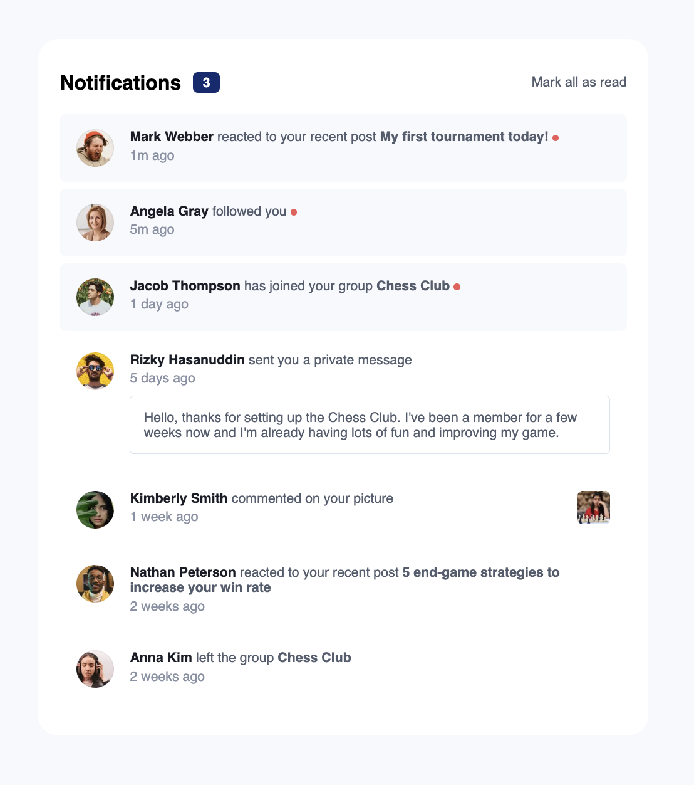

# Name of Project

Short description goes here ...

## Table of contents

- [Overview](#overview)

  - [Links](#links)
  - [The challenge](#the-challenge)
  - [Screenshot](#screenshot)

- [My process](#my-process)
  - [Built with](#built-with)
  - [What I learned](#what-i-learned)
  - [Continued development](#continued-development)
  - [Useful resources](#useful-resources)
- [Author](#author)
- [Acknowledgments](#acknowledgments)

## Overview

### Links

- Live Demo [Notifications Page Component](https://akagan-notifications-component.netlify.app/)

### The challenge

Users should be able to:

- Distinguish between "unread" and "read" notifications
- Select "Mark all as read" to toggle the visual state of the unread notifications and set the number of unread messages to zero
- Mark individual unread posts as read by clicking on the post
- View the optimal layout for the interface depending on their device's screen size
- See hover and focus states for all interactive elements on the page

### Screenshot



## My process

### Built with

- Semantic HTML
- CSS
- Flexbox
- Mobile-first workflow

### What I learned

- How to remove event listeners for handlers that need to be passed arguments

```js
function markRead(post) {
  post.classList.remove('unread-post');
  notificationCount.innerText = parseInt(notificationCount.innerText) - 1;
  console.log(
    post.querySelector('.unread-icon').classList.remove('unread-icon')
  );
  post.removeEventListener('click', markReadHandler);
}

function markReadHandler() {
  markRead(this); // Call the markRead function with the clicked element
}

unreadPosts.forEach((post) => {
  post.addEventListener('click', markReadHandler);
});
```

## Author

- Portfolio - [aaronkagan.dev](https://www.aaronkagan.dev)
- Linkedin - [/aaron-kagan](https://www.linkedin.com/in/aaron-kagan/)
- X - [@aaronkagandev](https://www.twitter.com/aaronkagandev)
- Instagram - [aaronkagandev](https://www.instagram.com/aaronkagandev/)
